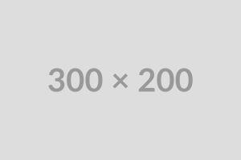

=========
Specimens
=========

This section only exists to create items for output in :numref:`Section {number}: {name}<examples:Output Examples>`.

.. figure:: media/640x400.png
   :alt: Example Figure in parent section
   :name: example-figure-parent

   This is an example figure in a parent section

There is a figure above this, it has a name attribute of ``example-figure-parent``, so it will not have a standard id.
Below is a table.

.. table:: Example Table in parent section
   :name: tbl:example-table-parent

   +------------+------------+
   | Header 1   | Header 2   |
   +============+============+
   | Cell 1     | Cell 2     |
   +------------+------------+
   | Cell 3     | Cell 4     |
   +------------+------------+

This is an example table in a parent section.

Subsection 1
*************
This is a subsection, one level below it's parent.

.. versionadded:: 1.0.0
   Initial Release

   This is an example figure in subsection 1.

.. table:: Example Table in subsection 1
   :name: example-table-subsection-1

   +------------+------------+
   | Header 1   | Header 2   |
   +============+============+
   | Cell 1     | Cell 2     |
   +------------+------------+
   | Cell 3     | Cell 4     |
   +------------+------------+

This is an example table in subsection 1.
It has a name attribute of ``example-table-subsection-1``, so it will not have a standard id.

Subsection 2
************
This section will not have any figures or tables in it's main body, but will in it's sub.

Subsection 2.1
~~~~~~~~~~~~~~
This is a subsection of subsection 2.

.. versionchanged:: 1.0.0
   Initial Release, example change

   This is an example figure in subsection 2.1.

.. versionadded:: 0.0.2
   Example addition under a different version

.. table:: Example Table in subsection 2.1

   +------------+------------+
   | Header 1   | Header 2   |
   +============+============+
   | Cell 1     | Cell 2     |
   +------------+------------+
   | Cell 3     | Cell 4     |
   +------------+------------+

This is an example table in subsection 2.1.
